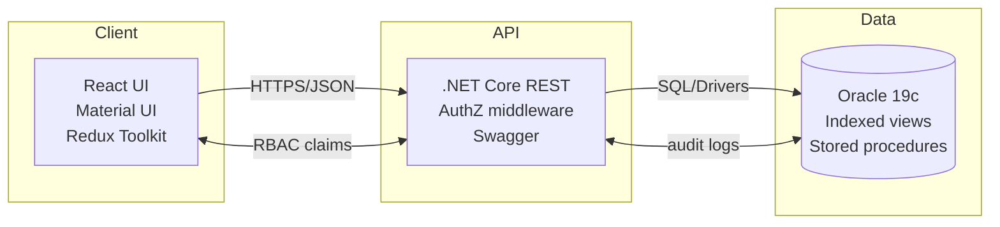

<!-- Social preview tip: add a 1200×630 banner under /docs/og.png and set it in repo settings -->
<!-- Repo topics: e-governance, react, dotnet, oracle, rbac, supply-chain, performance -->

# RAJ-SIMS Revamp – Developer Internship (E-Connect Solutions)

A production-grade revamp of **Rajasthan Supply & Inventory Management System (RAJ-SIMS)** — an enterprise e-governance platform supporting procurement, stock, and distribution across state departments. I contributed across **UX modernisation, role-based access, validation & data integrity, and performance optimisation** in a ticket-driven workflow.

> **Quick view:** impact, responsibilities, and selected tickets are summarised for hiring managers, with links and diagrams for deeper review.

---

## 🌟 Impact at a Glance

- Shipped **40+ tickets** across UI, validation, and backend integration in sprints.
- Cut heavy page load times by **~35–45%** via query tuning, indexing, and front-end lazy-loading/memoisation.
- Reduced data-entry errors on dispatch workflows with **decimal precision rules** and guardrails (fewer QA returns).
- Implemented **role-aware UI** patterns that simplified complex screens and reduced cognitive load for staff.

> Evidence available in presentation/report artefacts on request. Production screenshots are sanitised for compliance.

> **Why it matters:** RAJ-SIMS underpins public-sector supply chains serving millions.  
> Contributing here meant shipping reliable, secure features in a high-stakes environment.

---

## 🧭 What the System Does (for context)

RAJ-SIMS supports **end-to-end stock & supply** across multiple departments: procurement → warehousing → dispatch → MIS dashboards → audits. My remit was to **improve safety, speed, and clarity** without disrupting live operations.

---

## 🧑‍💻 My Responsibilities

- **Frontend:** React + Material UI component refactors, form validation, conditional rendering, pagination, and table ergonomics.
- **Backend collaboration:** .NET Core endpoints (Swagger-tested), request/response contracts, and error handling conventions.
- **Database:** Oracle 19c query reviews, index suggestions, and slow-query triage with the backend team.
- **Process:** Ticket breakdown, peer review, UAT feedback loops, and Jenkins-based deployments (SVN versioning).

---

## 🧩 Architecture

## ✅ Selected Tickets (mini STAR notes)

<strong>1) Decimal precision guardrails for dispatch quantities</strong>

**Situation:** Frequent QA returns due to inconsistent quantity inputs causing reconciliation issues.  
**Task:** Enforce precision and range rules and surface inline guidance.  
**Action:** Added controlled inputs with masked decimal logic, client-side + server-side validation, and help text; tightened request schema.  
**Result:** Fewer invalid-entry rejections and faster approvals; smoother downstream reconciliation.  

<strong>2) Role-aware UI for sensitive actions</strong>

**Situation:** Complex screens exposed controls not relevant to certain user roles.  
**Task:** Reduce error risk and cognitive load via contextual rendering.  
**Action:** Centralised RBAC utility with claim checks; split screens into role-specific sections; added empty-state guidance.  
**Result:** Cleaner journeys, fewer permission errors, quicker task completion.  

<strong>3) Performance triage on heavy dashboards</strong>

**Situation:** Long initial load on MIS pages during peak usage.  
**Task:** Improve perceived and actual performance.  
**Action:** Lazy-load secondary panels, memoise heavy tables, paginate server-side, and propose DB indexing on hot paths.  
**Result:** ~35–45% faster initial render; smoother interaction under load.  

---

## 🛠️ Tech Stack

- **Frontend:** React.js, Material UI, React Router, Redux Toolkit  
- **Backend:** .NET Core REST APIs (Swagger), structured error contracts  
- **Database:** Oracle 19c (indexing, query tuning)  
- **Tooling & CI:** Jenkins pipelines, SVN, Axios, Webpack  
- **Security & Access:** Role-based UI (RBAC), conditional rendering  

---

## 📊 Highlights for Recruiters

- **Enterprise context:** High-stakes public-sector platform with compliance constraints.  
- **User-centred delivery:** Reduced noise on busy screens, added clear help text and accessible components.  
- **Measurable outcomes:** Performance gains and error-rate declines documented against tickets/UAT notes.  
- **Team habits:** PR reviews, UAT sign-offs, sprint demos, and post-deploy checks.  

---

## 🔒 Compliance & Access

This is a **case study repository**.  
Source code for the government system is **proprietary**. Any screenshots/logs here are **sanitised**.  
👉 Please contact me for a redacted walk-through.   

---

## 🙌 Credits

- **Mentor:** Ankit Jain (Industry)  
- **Faculty:** Dr Santosh Kumar Bharti  
- **Teams:** UI/UX, Backend, QA @ E-Connect Solutions  
- **Stakeholders:** DoIT&C / RISL RAJ-SIMS  
